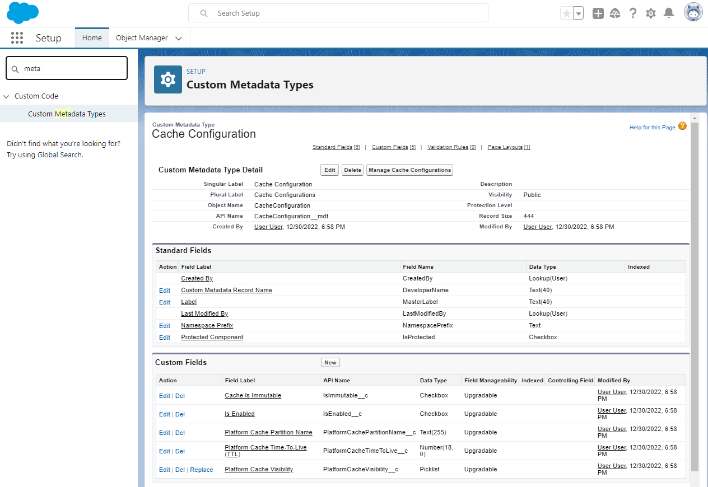
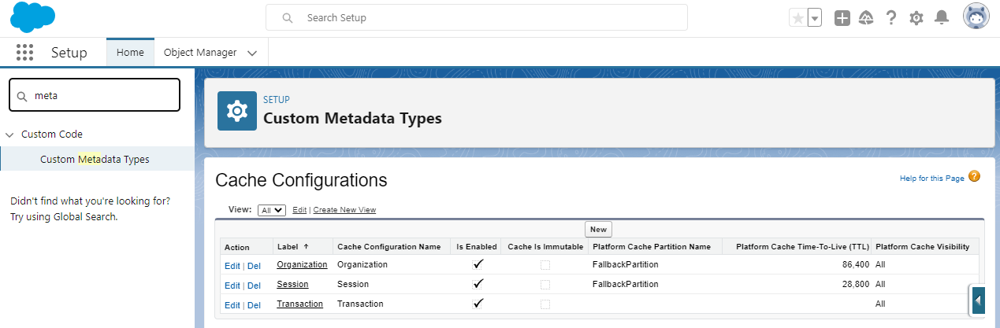
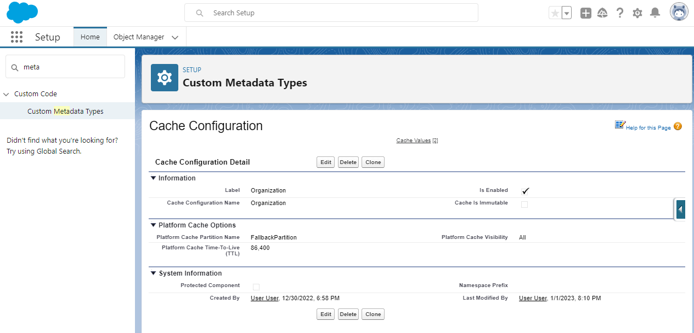
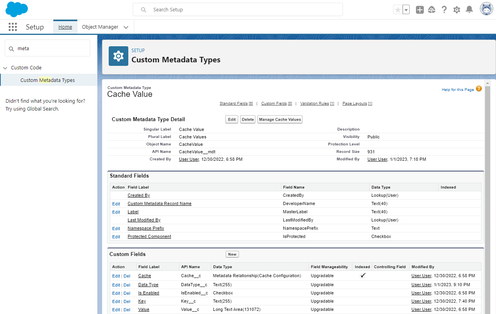
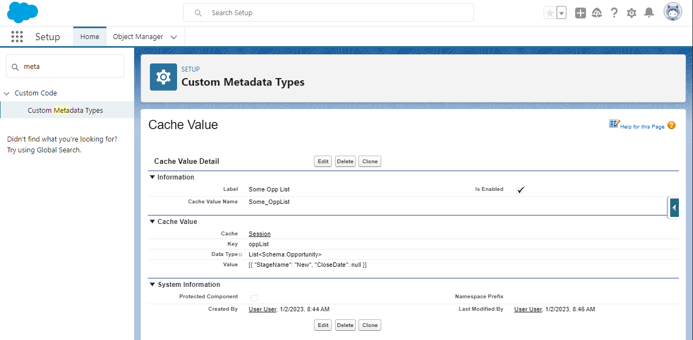

# Iteratively Building a Flexible Caching System

When it comes to developing in Apex, we need to always be aware of any platform limitations. And often, data that we need to use in Apex can come with overhead to retrieve or generate. In particular, I've found myself especially concerned with 3 limits:

1. SOQL query limits: Apex has a limit on the number of queries you can execute per transaction. Furthermore, queries on large objects (with millions of rows of data) can be slow, which slows down other parts of the system for users.
2. CPU time limits: some data is generated in-memory by Apex code, which can also slow down other parts of the system for users.
3. Callout limits: some data lives outside of Salesforce, and Salesforce developers needs to retrieve it within Apex. There are not only limits on the number of callouts per transaction, but also limits on when you can make a callout in Apex - you cannot make a callout after running a DML statement, which can make Apex development even more challenging for developers that need to implement tight integrations with external systems.

Recently when working on [Nebula Logger](https://nebulalogger.com), there were several areas that caused issues for customer orgs with large data volumes (LDV). Over the course of about a month, I implemented several enhancements to help alleviate some of the slowness by implementing [a caching system](https://github.com/jongpie/NebulaLogger/blob/v4.9.9/nebula-logger/core/main/configuration/classes/LoggerCache.cls). The caching system not only helped with Nebula Logger's performance, but it also laid the groundwork for a standalone cache management system that I've released as another open source project + unlocked packages: [Nebula Cache Manager](https://github.com/jongpie/NebulaCacheManager)

And in today's article, I'd like to walk through some of the thoughts & iterations I made when implementing the system. We'll start by implementing an incredibly basic caching system in 3 lines of code, and by the end, we'll have a scalable & configurable caching system, using 400+ lines of Apex code & 2 custom metadata types.

## Prerequisite: Understanding Apex Static Variables

Before we build a cache system, it's important to understand how Apex handles static variables, as well as how transactions impact them. Luckily, it doesn't take much code to demonstrate some of the relevant behavior. In this example, I'm querying the `Group` object, which stores [queues](https://www.salesforceben.com/everything-you-need-to-know-about-salesforce-queues/). If you have ever tried to automatically assign a record to a queue, you may have already found that queue data has to be queried - there are no built-in Apex classes or methods that can be used to retrieve this data. And typically, queues do not change frequently, which makes them a great candidate for data to cache.

Using a static variable in Apex, we can query & cache the data inline, like this:

```java
public class SomeClass {
  private static List<Group> queues;

  public List<Group> getQueues() {
    if (queues == null) {
      queues = [SELECT Id, DeveloperName, Email, Name FROM Group WHERE Type = 'Queue'];
    }
    return queues;
  }
}
```

Once a static variable is set in Apex, its value will remain for the duration of the transaction (or until Apex code changes the value). As described in the [Apex Developer Guide](https://developer.salesforce.com/docs/atlas.en-us.apexcode.meta/apexcode/apex_classes_static.htm), "A static variable is static only within the scope of the Apex transaction. It’s not static across the server or the entire organization." This has 2 implications for caching data using only static variables:

1. Good: Using static variables is a great way to have a centralized place to store data that (typically) does not change during a single transaction
2. Bad: Using static variables still requires (in this case) that a query runs in every transaction in order to populate the data.

If you have multiple Apex classes querying the same data (in this case, queues), you can reduce your number of queries to 1 by storing the queried data in a static variable that other classes can reference. This alone can be a great improvement in some orgs - I've seen orgs where multiple classes are using queue data, but each class runs its own query, resulting in duplicate/similar queries that consume the SOQL query limits. By centralizing the data into 1 static variable, and updating other classes to use the static variable, we can reduce multiple SOQL queries into 1 query per transaction.

## Prerequesites: Platform Cache Crash Course

Although static variables can be used to help reduce overhead (such as queries or computing data) in a transaction, they only last for the duration of the transaction, and still require _some_ overhead to populate the static variables in every transaction. Ideally, we should have a way to cache data across transactions - this is where Salesforce's [platform cache](https://developer.salesforce.com/docs/atlas.en-us.apexcode.meta/apexcode/apex_cache_namespace_overview.htm) can help.

Platform cache is an additional layer available in Apex that can be used to cache data across multiple transactions, which is a critical feature to have within a cache management system. Let's look at the highlights of how platform cache works:

- Platform cache stores cached data in [cache partitions](https://developer.salesforce.com/docs/atlas.en-us.apexcode.meta/apexcode/apex_platform_cache_features.htm), and currently supports 2 types of partitions

  1. **Organization cache**: data cached in the org partition is available in Apex for any user, which provides a great place to cache data that _is not_ user-specific.
  2. **Session cache**: data cached in the org partition is available in Apex a specific session for a specific user, which provides a great place to cache data that _is_ user-specific.

- The [`Cache` namespace](https://developer.salesforce.com/docs/atlas.en-us.apexref.meta/apexref/apex_namespace_cache.htm) has several classes that can be used to interact with platform cache. When populating & retrieving data from platform cache, Apex developers can specify which
- `null` values are not supported in platform cache
- There are limitations on what `String` values can be used for keys within platform cache.
- Exceptions are automatically thrown by Salesforce if there are configuration issues
  - An exception is thrown if the specified partition name doesn't exist
  - An exception is thrown if the specified partition doesn't have any available storage space

Certainly, this is not _everything_ about how platform cache works, but it's a good summary of the core features. If you'd like to learn more about platform cache, Salesforce has [a 'Platform Cache Basics' Trailhead module](https://trailhead.salesforce.com/content/learn/modules/platform_cache) with some hands-on activities.

And by using platform cache, we can rewrite our example class to provide caching that spans multiple transactions.

```java
public class SomeClass {
  public static List<Group> getQueues() {
    Cache.OrgPartition orgPartition = Cache.Org.getPartition('MyPartition');
    String cacheKey = 'queues';
    List<Group> queues;
    if (orgPartition.contains(cacheKey)) {
      queues = (List<Group>) orgPartition.get(key);
    } else {
      queues = [SELECT Id, DeveloperName, Email, Name FROM Group WHERE Type = 'Queue'];
      orgPartition.put(key, queues);
    }
    return queues;
  }
}
```

With these changes in place, we now have a way to cache & retrieve queues across multiple transactions - this is a fanstatic start to improving the performance of our Apex code. But the number of lines of code needed has quickly grown already, we haven't handled some of the possible exceptions that platform cache can throw, and we've hardcoded the partition name.

We can take this further.
It's time to build a centralized cache management system!

## 1. Start Small: Implementing A Simple Transaction Cache

Now that we've discussed how constants & static variables work in Apex, let's start there. We need a fancy caching system in Apex - it should

- Provide Apex developers with the ability to add, retrieve, update, and clear cached data
- Support caching of any Apex data type
- Leverage a "key" name (`String`) as a way to add & retrieve cached data
  - Inherently, the key must also be unique, so the cache system should enforce uniqueness

In the words of Kent Beck, "start small or not at all." And we can implement all of these features, using only 3 lines of code - we really can't get any smaller than this.

```java
public without sharing class CacheManager_v1_super_simple {
    public static final Map<String, Object> TRANSACTION_CACHE = new Map<String, Object>();
}
```

By using [a map](https://developer.salesforce.com/docs/atlas.en-us.apexref.meta/apexref/apex_methods_system_map.htm) to store cached data, any Apex code can now add & retrieve cached data that will be cached for the duration of an Apex transaction. This could be used for queried data, such as:

```java
public class SomeClass {
  public static List<Group> getQueues() {
    String cacheKey = 'queues';
    List<Group> queues;
    if (CacheManager.TRANSACTION_CACHE.containsKey(cacheKey)) {
      queues = (List<Group>) CacheManager.TRANSACTION_CACHE.get(key);
    } else {
      queues = [SELECT Id, DeveloperName, Email, Name FROM Group WHERE Type = 'Queue'];
      orgPartition.put(key, queues);
    }
    return queues;
  }
}
```

This is a good starting point of a caching system, even if it's limited. Any Apex class in your org can now use a `String` key to cache any Apex data type - in the process, we're using some of Salesforce's heap size limits, but this seems like a good compromise for the sake of providing a centralized cache management system.

<!-- TODO delete -->
<!-- ### Considerations / Things To Be Aware Of

- Heap size is consumed
- Naming of keys could lead to separate, unrelated classes accidentally overwriting each other's cached data by unintentionally reusing the same key -->

## 2. Abstracting The Transaction Cache Implementation

The 3-line version of `CacheManager` is effective, but the implementation & the underlying data structure (`Map<String, Object>`) are currently the same thing - there's no abstraction at the moment, which can make it difficult to added additional safeguards & functionality into the caching system. Let's take the `CacheManager` class a step further, and we'll added a new inner class & methods to abstract away some of the inner-workings.

A bit of a prefactor here, but knowing that I want to also support using platform cache (and that I don't like to expose static variables), let's start by making an inner class to represent the transaction cache. This will make it easier in the next section to add support for new cache types.

```java
public without sharing class CacheManager_v2_transaction_class {
  private static TransactionCache transactionCache;

  public static TransactionCache getTransactionCache() {
    if (transactionCache == null) {
      transactionCache = new TransactionCache();
    }

    return transactionCache;
  }

  public class TransactionCache {
    private final Map<String, Object> keyToValue = new Map<String, Object>();

    private TransactionCache() {
    }

    public Boolean contains(String key) {
      return this.keyToValue.containsKey(key);
    }

    public Object get(String key) {
      return this.keyToValue.get(key);
    }

    public void put(String key, Object value) {
      this.keyToValue.put(key, value);
    }

    public void remove(String key) {
      this.keyToValue.remove(key);
    }
  }
}
```

Internally, the transaction cache is still using the same `Map<String, Object>` data structure for caching, but that implementation detail is now hidden from consumers of `CacheManager`. An singleton instance of the new `TransactionCache` class now provides methods that interact with the `private Map<String, Object>` variable. These methods also provide the ability to further control how data is added, updated & removed in the cache (which we'll implement later).

Now, our example class can use the new `getTransactionCache()` method, instead of directly accessing the `Map<String, Object>`.

```java
public class SomeClass {
  public static List<Group> getQueues() {
    String cacheKey = 'queues';
    List<Group> queues;
    if (CacheManager.getTransactionCache().contains(cacheKey)) {
      queues = (List<Group>) CacheManager.getTransactionCache().get(key);
    } else {
      queues = [SELECT Id, DeveloperName, Email, Name FROM Group WHERE Type = 'Queue'];
      orgPartition.put(key, queues);
    }
    return queues;
  }
}
```

## 3. Caching Data Across Transactions, Using Platform Cache

TODO - Discuss platform cache overview

The `CacheManager` class now provides a way for managing the transaction cache, and the underlying data structure has been safely tucked away from consumers of `CacheManager`. Developers can add, update, retrieve & remove cached data as needed via Apex. But fundamentally, the transaction cache has a flaw - the cached data only lasts for the life of the transaction, so every Apex transaction (that uses the cached data) will still have overhead of querying/generating data & adding it to the cache. By leveraging platform cache, we can start caching data across Apex's transaction boundaries.

<!-- TODO add details about how much platform cache allocation is included in orgs by default  -->
<!-- It's important to note that orgs have XX platform cache space included  -->

TODO walk through creating a platform cache partition (with screenshots)

Let's incorporate Platform Cache into the `CacheManager` class - this will provide 3 types of cache

1. Transaction cache: the original cache we started with, using `Map<String, Object>`
2. Organization cache: our platform cache partition's org cache
3. Session cache: our platform cache partition's session cache

Ideally, Apex developers should be able to use all 3 cache types in the same way - developers will want to choose which cache type makes the most sense for each dataset being cached, but _using_ each cache should be consistent. This is a great time to introduce a new `interface` that all 3 cache types implement. The `TransactionCache` class already has several methods, so let's make a new `interface` with those methods.

```java
public without sharing class CacheManager_v3_cacheable_interface {
  @TestVisible
  private static final List<CacheValue__mdt> DECLARATIVE_CACHE_VALUES = CacheValue__mdt.getAll().values();

  private static Cacheable transactionCache;

  public interface Cacheable {
    Boolean contains(String key);
    Object get(String key);
    void put(String key, Object value);
    void remove(String key);
  }

  // The getTransactionCache() method now returns an instance of Cacheable, instead of TransactionCache
  // This provides yet another layer of abstraction for consumers of CacheManager, and ensures that how
  // consumers interact with each cache type is consistent (by adhering to the Cacheable interface's methods)
  public static Cacheable getTransactionCache() {
    if (transactionCache == null) {
      transactionCache = new TransactionCache();
    }

    return transactionCache;
  }

  // The TransactionCache class can now be marked as private - consumers of CacheManager will only need to know about the Cacheable interface
  private class TransactionCache implements Cacheable {
    private final Map<String, Object> keyToValue = new Map<String, Object>();

    private TransactionCache() {
    }

    public Boolean contains(String key) {
      return this.keyToValue.containsKey(key);
    }

    public Object get(String key) {
      return this.keyToValue.get(key);
    }

    public void put(String key, Object value) {
      this.keyToValue.put(key, value);
    }

    public void remove(String key) {
      this.keyToValue.remove(key);
    }
  }
}
```

With our new `Cacheable` interface in place, we've completed abstracted away the `TransactionCache` (it's now `private`), and we've laid the foundation for supporting new types of caches for developers to use. Let's update `CacheManager` to use Platform Cache.

```java
public class CacheManager_v4_with_platform_cache {
  private static final String PLATFORM_CACHE_NULL_VALUE = '<{(CACHE_VALUE_IS_NULL)}>'; // Presumably, no one will ever use this as an actual value

  private static PlatformCache organizationCacheInstance;
  private static PlatformCache sessionCacheInstance;
  private static TransactionCache transactionCache;

  public interface Cacheable {
    Boolean contains(String key);
    Object get(String key);
    void put(String key, Object value);
    void remove(String key);
  }

  public static Cacheable getOrganizationCache() {
    if (organizationCacheInstance == null) {
      // For now, the partition name is hardcoded 😭 But we'll revisit this soon!
      Cache.Partition organizationPartition = Cache.Org.getPartition('CacheManagerPartition');
      organizationCacheInstance = new PlatformCache(organizationPartition, getTransactionCache());
    }

    return organizationCacheInstance;
  }

  public static Cacheable getSessionCache() {
    if (sessionCacheInstance == null) {
      // For now, the partition name is hardcoded 😭 But we'll revisit this soon!
      Cache.Partition sessionPartition = Cache.Session.getPartition('CacheManagerPartition');
      sessionCacheInstance = new PlatformCache(sessionPartition, getTransactionCache());
    }

    return sessionCacheInstance;
  }

  public static Cacheable getTransactionCache() {
    if (transactionCache == null) {
      transactionCache = new TransactionCache();
    }

    return transactionCache;
  }

  private class PlatformCache implements Cacheable {
    private final Cache.Partition platformCachePartition;
    private final Boolean cacheIsImmutable = true;
    private final Integer cacheTtlSeconds;
    private final Cache.Visibility cacheVisibility = Cache.Visibility.All;
    private final Cacheable transactionCache;

    private PlatformCache(Cache.Partition platformCachePartition, Cacheable transactionCache) {
      this.transactionCache = transactionCache;
      this.platformCachePartition = platformCachePartition;
    }

    public Boolean contains(String key) {
      if (this.transactionCache.contains(key) || this.platformCachePartition.isAvailable() == false) {
        return this.transactionCache.contains(key);
      } else {
        return this.platformCachePartition.contains(key);
      }
    }

    public Object get(String key) {
      if (this.transactionCache.contains(key) || this.platformCachePartition.isAvailable() == false) {
        return this.transactionCache.get(key);
      } else {
        Object value = this.platformCachePartition.get(key);
        // Platform cache does not support storing null values, so a predefined value is used as a substitute
        if (value == PLATFORM_CACHE_NULL_VALUE) {
          value = null;
        }
        this.transactionCache.put(key, value);
        return value;
      }
    }

    public void put(String key, Object value) {
      this.transactionCache.put(key, value);

      if (this.platformCachePartition.isAvailable() == true) {
        // Platform cache does not support storing null values, so a predefined value is used as a substitute
        if (value == null) {
          value = PLATFORM_CACHE_NULL_VALUE;
        }

        this.platformCachePartition.put(key, value, this.cacheTtlSeconds, this.cacheVisibility, this.cacheIsImmutable);
      }
    }

    public void remove(String key) {
      this.transactionCache.remove(key);

      if (this.platformCachePartition.isAvailable() == true) {
        this.platformCachePartition.remove(key);
      }
    }
  }

  private class TransactionCache implements Cacheable {
    private final Map<String, Object> keyToValue = new Map<String, Object>();

    public Boolean contains(String key) {
      return this.keyToValue.containsKey(key);
    }

    public Object get(String key) {
      return this.keyToValue.get(key);
    }

    public void put(String key, Object value) {
      this.keyToValue.put(key, value);
    }

    public void remove(String key) {
      this.keyToValue.remove(key);
    }
  }
}
```

Now, the `CacheManager` provides 3 ways to cache data

1. `CacheManager.getOrganizationCache()` - leverages the org partition in Platform Cache for storing cached data, and internally supplements it with the transaction cache.
2. `CacheManager.getSessionCache()` - leverages the session partition in Platform Cache for storing cached data, and internally supplements it with the transaction cache.
3. `CacheManager.getTransactionCache()` - leverages `Map<String, Object>` for storing cached data, and internally supplements it with declaratively cached data stored in `CacheValue__mdt`

And because all 3 of these methods return an instance of the interface `CacheManager.Cacheable`, the way that developers interact with each cache type is the same - developers only need to decide where they want to cache data.

Furthermore, we've handled one quirk with platform cache - we've added support for `null` values (even though platform cache does not support `null` values) by using a substitute `String`, stored in the constant `PLATFORM_CACHE_NULL_VALUE`. Now, if Apex developers need to cache `null`, the `CacheManager` class handles substituting the placeholder `String` - it happens seemless for Apex developers.

## 4. Supporting Orgs That Don't Have Platform Cache Available

When implementing Nebula Logger's caching system, I ran into some additional limitations with platform cache - in orgs that do not have platform cache partition space allocated, adding data to a cache partition would result in an exception being thrown. For many orgs, this may not be an issue - if you're using platform cache in your org, then you simply need to configure a cache partition, and you're ready to go. But what about orgs that don't have available platform cache space? Or what if an admin misconfigures a cache partition? Throwing an exception doesn't seem ideal. Instead, I wanted the cache system to gracefully handle this, while still providing some level of caching. Furthermore, in Apex tests, you cannot create a mock cache partition, which really makes testing more challenging.

To help handled some of these nuances of platform cache, let's introduce a new private inner class, `PlatformCachePartitionProxy`, that uses the [proxy structural pattern](https://refactoring.guru/design-patterns/proxy) to handle all interactions with cache partitions..

```java
public without sharing class CacheManager_v5_partition_proxy {
  @TestVisible
  private static final String PLATFORM_CACHE_NULL_VALUE = '<{(CACHE_VALUE_IS_NULL)}>'; // Presumably, no one will ever use this as an actual value

  private static PlatformCache organizationCacheInstance;
  private static PlatformCache sessionCacheInstance;
  private static TransactionCache transactionCacheInstance;

  private enum PlatformCacheType {
    ORGANIZATION,
    SESSION
  }

  public interface Cacheable {
    Boolean contains(String key);
    Object get(String key);
    Boolean isAvailable();
    void put(String key, Object value);
    void remove(String key);
  }

  public static Cacheable getOrganizationCache() {
    if (sessionCacheInstance == null) {
      Integer organizationCacheTtlSeconds = 86400; // 86,400 seconds == 24 hours, the max time-to-live (TTL) allowed for org cache
      // For now, the partition name is hardcoded 😭 But we'll revisit this soon!
      PlatformCachePartitionProxy partitionProxy = new PlatformCachePartitionProxy(PlatformCacheType.SESSION, 'CacheManager');
      sessionCacheInstance = getPlatformCache(new TransactionCache(), partitionProxy, organizationCacheTtlSeconds);
    }
    return sessionCacheInstance;
  }

  public static Cacheable getSessionCache() {
    if (sessionCacheInstance == null) {
      Integer sessionCacheTtlSeconds = 28800; // 28,800 seconds == 8 hours, the max time-to-live (TTL) allowed for session cache
      // For now, the partition name is hardcoded 😭 But we'll revisit this soon!
      PlatformCachePartitionProxy partitionProxy = new PlatformCachePartitionProxy(PlatformCacheType.SESSION, 'CacheManager');
      sessionCacheInstance = getPlatformCache(new TransactionCache(), partitionProxy, sessionCacheTtlSeconds);
    }
    return sessionCacheInstance;
  }

  public static Cacheable getTransactionCache() {
    if (transactionCacheInstance == null) {
      transactionCacheInstance = new TransactionCache();
    }

    return transactionCacheInstance;
  }

  private static void validateKey(String key) {
    Pattern targetPattern = Pattern.compile('^[a-zA-Z0-9]+$');

    Matcher regexMatcher = targetPattern.matcher(key);
    if (regexMatcher.matches() == false) {
      throw new IllegalArgumentException('Key must be alphanumeric, received key: ' + key);
    }
  }

  private static PlatformCache getPlatformCache(TransactionCache localTransactionCache, PlatformCachePartitionProxy partitionProxy, Integer cacheTtlSeconds) {
    PlatformCache platformCache = new PlatformCache(localTransactionCache, partitionProxy, cacheTtlSeconds);

    return platformCache;
  }

  private class PlatformCache implements Cacheable {
    private final PlatformCachePartitionProxy cachePartitionProxy;
    private final Integer cacheTtlSeconds;
    private final TransactionCache transactionCache;

    private PlatformCache(TransactionCache transactionCache, PlatformCachePartitionProxy cachePartitionProxy, Integer cacheTtlSeconds) {
      this.transactionCache = transactionCache;
      this.cachePartitionProxy = cachePartitionProxy;
      this.cacheTtlSeconds = cacheTtlSeconds;
    }

    public Boolean contains(String key) {
      if (this.transactionCache.contains(key) == true || this.cachePartitionProxy.isAvailable() == false) {
        return this.transactionCache.contains(key);
      } else {
        return this.cachePartitionProxy.contains(key);
      }
    }

    public Object get(String key) {
      if (this.transactionCache.contains(key) || this.cachePartitionProxy.isAvailable() == false) {
        return this.transactionCache.get(key);
      } else {
        Object value = this.cachePartitionProxy.get(key);
        // Platform cache does not support storing null values, so a predefined value is used as a substitute
        if (value == PLATFORM_CACHE_NULL_VALUE) {
          value = null;
        }
        this.transactionCache.put(key, value);
        return value;
      }
    }

    public Boolean isAvailable() {
      return this.cachePartitionProxy.isAvailable() == true;
    }

    public void put(String key, Object value) {
      validateKey(key);
      this.transactionCache.put(key, value);

      // Platform cache does not support storing null values, so a predefined value is used as a substitute
      if (value == null) {
        value = PLATFORM_CACHE_NULL_VALUE;
      }
      Cache.Visibility visibility = Cache.Visibility.ALL;
      Boolean isImmutable = false;
      this.cachePartitionProxy.put(key, value, this.cacheTtlSeconds, visibility, isImmutable);
    }

    public void remove(String key) {
      this.transactionCache.remove(key);
      if (this.isAvailable() == true) {
        this.cachePartitionProxy.remove(key);
      }
    }
  }

  @TestVisible
  private virtual class PlatformCachePartitionProxy {
    private final Cache.Partition platformCachePartition;

    protected PlatformCachePartitionProxy(PlatformCacheType cacheType, String partitionName) {
      // Since orgs can customize the platform cache partition (via CacheConfiguration__mdt.PlatformCachePartitionName__c),
      // some orgs could have problematic configurations (or may have even deleted the referenced partition),
      // and it seems better to eat the exceptions & fallback to the transaction cache (which doesn't rely on Platform Cache).
      // The alternative is a runtime exception, which isn't ideal.
      try {
        switch on cacheType {
          when ORGANIZATION {
            this.platformCachePartition = Cache.Org.getPartition(partitionName);
          }
          when SESSION {
            this.platformCachePartition = Cache.Session.getPartition(partitionName);
          }
        }
      } catch (Cache.Org.OrgCacheException orgCacheException) {
        // No-op if the partition can't be found - the rest of the code will fallback to using the transaction cache
      } catch (Cache.Session.SessionCacheException sessionCacheException) {
        // No-op if the partition can't be found - the rest of the code will fallback to using the transaction cache
      }
    }

    public virtual Boolean contains(String key) {
      return this.platformCachePartition?.contains(key) == true;
    }

    public virtual Object get(String key) {
      return this.platformCachePartition?.get(key);
    }

    public virtual Boolean isAvailable() {
      return this.platformCachePartition?.isAvailable() == true;
    }

    public virtual void put(String key, Object value, Integer cacheTtlSeconds, Cache.Visibility cacheVisiblity, Boolean isCacheImmutable) {
      this.platformCachePartition?.put(key, value, cacheTtlSeconds, cacheVisiblity, isCacheImmutable);
    }

    public virtual void remove(String key) {
      this.platformCachePartition?.remove(key);
    }
  }

  private class TransactionCache implements Cacheable {
    private final CacheConfiguration__mdt configuration;
    private final Map<String, Object> keyToValue = new Map<String, Object>();

    private TransactionCache() {
    }

    public Boolean contains(String key) {
      return this.keyToValue.containsKey(key);
    }

    public Object get(String key) {
      return this.keyToValue.get(key);
    }

    public Boolean isAvailable() {
      return true;
    }

    public void put(String key, Object value) {
      validateKey(key);
      this.keyToValue.put(key, value);
    }

    public void remove(String key) {
      this.keyToValue.remove(key);
    }
  }
}
```

With the new class `PlatformCachePartitionProxy` in place, the `CacheManager` class can now:

1. Gracefully handle non-existant cache partitions
2. Gracefully handle cache partitions that do not have storage allocated
3. Improve testability by provide a mock version of the `PlatformCachePartitionProxy` class that's used during test execution

At this point, this is effectively the same cache management system used internally by [Nebula Logger](https://github.com/jongpie/NebulaLogger/blob/v4.9.9/nebula-logger/core/main/configuration/classes/LoggerCache.cls), which as already provided some great improvements in several orgs. But if we want to build a standalone caching system, we can add several additional features to make it a highly scalable & configurable.

## 5. Scope-Creep Part 1: Declaratively Controlling Cache Runtime Behavior, Using `CacheConfiguration__mdt` Custom Metadata Type

When building reusable tools - espcially in Salesforce - I think it can be incredibly powerful to provide configurable controls that can be updated declaratively by admins & developers. In this case, I want to be able to configure several details about the caching system:

1. Be able to enable/disable the 3 different cache types (transaction cache, org platform cache, and session platform cache)
2. Be able to configure the name of the platform cache partition used by the org cache & session cache
3. Be able to configure the cache duration for platform cache
4. Support for multiple platform cache partitions
5. Control if cache values are immutable (meaning that cannot be changed until the cache expires) or mutable (any cached value can be overwritten at any time)

With these features in mind, let's create a new [custom metadata type (CMDT)](https://trailhead.salesforce.com/content/learn/modules/custom_metadata_types_dec) object to store the configurations. CMDT are a great way to store configurable data that can also be deployed, which seems like a great solution for our cache management system. In this case, I've created a new CMDT called `CacheConfiguration__mdt` with several fields to control the cache system's behavior.



And since we currently have 3 caches (transaction cache, org platform cache, and session cache), we can create a record for each cache.



Each record now provides an admin-friendly way to customize the caching system.



There's just one important step left - we need to incorporate new `CacheValue__mdt` object into the `CacheManager` class.

```java
public without sharing class CacheManager_v6_configurations {
  @TestVisible
  private static final Map<String, Cacheable> CONFIGURATION_DEVELOPER_NAME_TO_CACHEABLE_INSTANCE = new Map<String, Cacheable>();

  @TestVisible
  private static final List<CacheValue__mdt> DECLARATIVE_CACHE_VALUES = Schema.CacheValue__mdt.getAll().values();
  @TestVisible
  private static final String PLATFORM_CACHE_NULL_VALUE = '<{(CACHE_VALUE_IS_NULL)}>'; // Presumably, no one will ever use this as an actual value
  private static final CacheConfiguration__mdt ORGANIZATION_CACHE_CONFIGURATION = Schema.CacheConfiguration__mdt.getInstance('Organization');
  private static final CacheConfiguration__mdt SESSION_CACHE_CONFIGURATION = Schema.CacheConfiguration__mdt.getInstance('Session');
  private static final CacheConfiguration__mdt TRANSACTION_CACHE_CONFIGURATION = Schema.CacheConfiguration__mdt.getInstance('Transaction');

  private enum PlatformCacheType {
    ORGANIZATION,
    SESSION
  }

  public interface Cacheable {
    Boolean contains(String key);
    Object get(String key);
    Boolean isAvailable();
    Boolean isEnabled();
    Boolean isImmutable();
    void put(String key, Object value);
    void remove(String key);
  }

  public static Cacheable getOrganizationCache() {
    return getOrganizationCache(ORGANIZATION_CACHE_CONFIGURATION);
  }

  public static Cacheable getOrganizationCache(CacheConfiguration__mdt configuration) {
    return getPlatformCache(configuration, PlatformCacheType.ORGANIZATION);
  }

  public static Cacheable getSessionCache() {
    return getSessionCache(SESSION_CACHE_CONFIGURATION);
  }

  public static Cacheable getSessionCache(CacheConfiguration__mdt configuration) {
    return getPlatformCache(configuration, PlatformCacheType.SESSION);
  }

  public static Cacheable getTransactionCache() {
    if (CONFIGURATION_DEVELOPER_NAME_TO_CACHEABLE_INSTANCE.containsKey(TRANSACTION_CACHE_CONFIGURATION.DeveloperName)) {
      return CONFIGURATION_DEVELOPER_NAME_TO_CACHEABLE_INSTANCE.get(TRANSACTION_CACHE_CONFIGURATION.DeveloperName);
    }

    TransactionCache transactionCacheInstance = new TransactionCache(TRANSACTION_CACHE_CONFIGURATION);
    CONFIGURATION_DEVELOPER_NAME_TO_CACHEABLE_INSTANCE.put(TRANSACTION_CACHE_CONFIGURATION.DeveloperName, transactionCacheInstance);

    return transactionCacheInstance;
  }

  private static void validateKey(String key) {
    Pattern targetPattern = Pattern.compile('^[a-zA-Z0-9]+$');

    Matcher regexMatcher = targetPattern.matcher(key);
    if (regexMatcher.matches() == false) {
      throw new IllegalArgumentException('Key must be alphanumeric, received key: ' + key);
    }
  }

  private static Cacheable getPlatformCache(CacheConfiguration__mdt configuration, PlatformCacheType cacheType) {
    if (CONFIGURATION_DEVELOPER_NAME_TO_CACHEABLE_INSTANCE.containsKey(configuration.DeveloperName)) {
      return CONFIGURATION_DEVELOPER_NAME_TO_CACHEABLE_INSTANCE.get(configuration.DeveloperName);
    }

    PlatformCachePartitionProxy partitionProxy = new PlatformCachePartitionProxy(cacheType, configuration.PlatformCachePartitionName__c);
    CacheConfiguration__mdt localTransactionCacheConfiguration = new CacheConfiguration__mdt(
      IsEnabled__c = true,
      IsImmutable__c = configuration.IsImmutable__c
    );

    PlatformCache platformCache = new PlatformCache(configuration, new TransactionCache(localTransactionCacheConfiguration), partitionProxy);
    CONFIGURATION_DEVELOPER_NAME_TO_CACHEABLE_INSTANCE.put(configuration.DeveloperName, platformCache);

    return platformCache;
  }

  private class PlatformCache implements Cacheable {
    private final PlatformCachePartitionProxy cachePartitionProxy;
    private final CacheConfiguration__mdt configuration;
    private final TransactionCache transactionCache;

    private PlatformCache(CacheConfiguration__mdt configuration, transactionCache transactionCache, PlatformCachePartitionProxy cachePartitionProxy) {
      this.configuration = configuration;
      this.transactionCache = transactionCache;
      this.cachePartitionProxy = cachePartitionProxy;
    }

    public Boolean contains(String key) {
      if (this.configuration.IsEnabled__c == false || this.transactionCache.contains(key) || this.cachePartitionProxy.isAvailable() == false) {
        return this.transactionCache.contains(key);
      } else {
        return this.cachePartitionProxy.contains(key);
      }
    }

    public Object get(String key) {
      if (this.transactionCache.contains(key) || this.cachePartitionProxy.isAvailable() == false) {
        return this.transactionCache.get(key);
      } else {
        Object value = this.cachePartitionProxy.get(key);
        // Platform cache does not support storing null values, so a predefined value is used as a substitute
        if (value == PLATFORM_CACHE_NULL_VALUE) {
          value = null;
        }
        this.transactionCache.put(key, value);
        return value;
      }
    }

    public Boolean isAvailable() {
      return this.isEnabled() && this.cachePartitionProxy.isAvailable() == true;
    }

    public Boolean isEnabled() {
      return this.configuration?.IsEnabled__c == true;
    }

    public Boolean isImmutable() {
      return this.configuration?.IsImmutable__c == true;
    }

    public void put(String key, Object value) {
      if (this.isEnabled() == false) {
        return;
      }

      validateKey(key);
      this.transactionCache.put(key, value);

      if (this.isAvailable() == true && this.isImmutable() == false || this.contains(key) == false) {
        // Platform cache does not support storing null values, so a predefined value is used as a substitute
        if (value == null) {
          value = PLATFORM_CACHE_NULL_VALUE;
        }
        Cache.Visibility visibility = Cache.Visibility.valueOf(this.configuration.PlatformCacheVisibility__c.toUpperCase());
        this.cachePartitionProxy.put(key, value, this.configuration.PlatformCacheTimeToLive__c.intValue(), visibility, this.configuration.IsImmutable__c);
      }
    }

    public void remove(String key) {
      if (this.isImmutable() == true) {
        return;
      }

      this.transactionCache.remove(key);
      if (this.isAvailable() == true) {
        this.cachePartitionProxy.remove(key);
      }
    }

    public void remove(Set<String> keys) {
      for (String key : keys) {
        this.remove(key);
      }
    }
  }

  @TestVisible
  private virtual class PlatformCachePartitionProxy {
    private final Cache.Partition platformCachePartition;

    protected PlatformCachePartitionProxy(PlatformCacheType cacheType, String partitionName) {
      // Since orgs can customize the platform cache partition (via CacheConfiguration__mdt.PlatformCachePartitionName__c),
      // some orgs could have problematic configurations (or may have even deleted the referenced partition),
      // and it seems better to eat the exceptions & fallback to the transaction cache (which doesn't rely on Platform Cache).
      // The alternative is a runtime exception, which isn't ideal.
      try {
        switch on cacheType {
          when ORGANIZATION {
            this.platformCachePartition = Cache.Org.getPartition(partitionName);
          }
          when SESSION {
            this.platformCachePartition = Cache.Session.getPartition(partitionName);
          }
        }
      } catch (Cache.Org.OrgCacheException orgCacheException) {
        // No-op if the partition can't be found - the rest of the code will fallback to using the transaction cache
      } catch (Cache.Session.SessionCacheException sessionCacheException) {
        // No-op if the partition can't be found - the rest of the code will fallback to using the transaction cache
      }
    }

    public virtual Boolean contains(String key) {
      return this.platformCachePartition?.contains(key) == true;
    }

    public virtual Object get(String key) {
      return this.platformCachePartition?.get(key);
    }

    public virtual Boolean isAvailable() {
      return this.platformCachePartition?.isAvailable() == true;
    }

    public virtual void put(String key, Object value, Integer cacheTtlSeconds, Cache.Visibility cacheVisiblity, Boolean isCacheImmutable) {
      this.platformCachePartition?.put(key, value, cacheTtlSeconds, cacheVisiblity, isCacheImmutable);
    }

    public virtual void remove(String key) {
      this.platformCachePartition?.remove(key);
    }
  }

  private class TransactionCache implements Cacheable {
    private final CacheConfiguration__mdt configuration;
    private final Map<String, Object> keyToValue = new Map<String, Object>();

    private TransactionCache(CacheConfiguration__mdt configuration) {
      this.configuration = configuration;
    }

    public Boolean contains(String key) {
      return this.keyToValue.containsKey(key);
    }

    public Object get(String key) {
      return this.keyToValue.get(key);
    }

    public Boolean isAvailable() {
      return this.isEnabled() == true;
    }

    public Boolean isEnabled() {
      return this.configuration?.IsEnabled__c == true;
    }

    public Boolean isImmutable() {
      return this.configuration?.IsImmutable__c == true;
    }

    public void put(String key, Object value) {
      if (this.isEnabled() == true || (this.isImmutable() == false || this.contains(key) == false)) {
        validateKey(key);
        this.keyToValue.put(key, value);
      }
    }

    public void remove(String key) {
      if (this.isEnabled() == true && this.isImmutable() == false) {
        this.keyToValue.remove(key);
      }
    }
  }
}
```

Although this change involves modifying nearly every method within `CacheManager`, the changes are seemless to Apex developers, and do not impact the way that the caching system is used.

## 6. Scope-Creep Part 2: Declaratively Populating Cache Data Across Transactions, Using `CacheValue__mdt` Custom Metadata Type

We now have a strong foundation for caching data, and we can control the behavior of the caching system using the new `CacheConfiguration__mdt` custom metadata type. But one limitation with the current system: it still requires a developer to write code to populate/update the cached value. But what if some data doesn't change very frequently (and thus, can be cached for longer than the duration supported by platform cache)? If an urgent issue comes up & the Apex code that caches the data is incorrect, do developers need to immediately deploy a hotfix to correct it?

Let's provide an admin-friendly way that supports overriding cached values. We can add a new custom metadata type as another mechanism for storing cached data. Let's start with building a new custom metadata type that we'll call `CacheValue__mdt`





Now that we have a declarative place to store cached data, let's incorporate it into the `CacheManager` class.

```java
public without sharing class CacheManager_v7_declarative_cache {
  @TestVisible
  private static final Map<String, Cacheable> CONFIGURATION_DEVELOPER_NAME_TO_CACHEABLE_INSTANCE = new Map<String, Cacheable>();

  @TestVisible
  private static final List<CacheValue__mdt> DECLARATIVE_CACHE_VALUES = Schema.CacheValue__mdt.getAll().values();
  @TestVisible
  private static final String PLATFORM_CACHE_NULL_VALUE = '<{(CACHE_VALUE_IS_NULL)}>'; // Presumably, no one will ever use this as an actual value
  private static final CacheConfiguration__mdt ORGANIZATION_CACHE_CONFIGURATION = Schema.CacheConfiguration__mdt.getInstance('Organization');
  private static final CacheConfiguration__mdt SESSION_CACHE_CONFIGURATION = Schema.CacheConfiguration__mdt.getInstance('Session');
  private static final CacheConfiguration__mdt TRANSACTION_CACHE_CONFIGURATION = Schema.CacheConfiguration__mdt.getInstance('Transaction');

  private enum PlatformCacheType {
    ORGANIZATION,
    SESSION
  }

  public interface Cacheable {
    Boolean contains(String key);
    Object get(String key);
    Boolean isAvailable();
    Boolean isEnabled();
    Boolean isImmutable();
    void put(String key, Object value);
    void put(Map<String, Object> keyToValue);
    void remove(String key);
  }

  public static Cacheable getOrganizationCache() {
    return getOrganizationCache(ORGANIZATION_CACHE_CONFIGURATION);
  }

  public static Cacheable getOrganizationCache(CacheConfiguration__mdt configuration) {
    return getPlatformCache(configuration, PlatformCacheType.ORGANIZATION);
  }

  public static Cacheable getSessionCache() {
    return getSessionCache(SESSION_CACHE_CONFIGURATION);
  }

  public static Cacheable getSessionCache(CacheConfiguration__mdt configuration) {
    return getPlatformCache(configuration, PlatformCacheType.SESSION);
  }

  public static Cacheable getTransactionCache() {
    if (CONFIGURATION_DEVELOPER_NAME_TO_CACHEABLE_INSTANCE.containsKey(TRANSACTION_CACHE_CONFIGURATION.DeveloperName)) {
      return CONFIGURATION_DEVELOPER_NAME_TO_CACHEABLE_INSTANCE.get(TRANSACTION_CACHE_CONFIGURATION.DeveloperName);
    }

    TransactionCache transactionCacheInstance = new TransactionCache(TRANSACTION_CACHE_CONFIGURATION);
    CONFIGURATION_DEVELOPER_NAME_TO_CACHEABLE_INSTANCE.put(TRANSACTION_CACHE_CONFIGURATION.DeveloperName, transactionCacheInstance);

    return transactionCacheInstance;
  }

  private static void validateKey(String key) {
    Pattern targetPattern = Pattern.compile('^[a-zA-Z0-9]+$');

    Matcher regexMatcher = targetPattern.matcher(key);
    if (regexMatcher.matches() == false) {
      throw new IllegalArgumentException('Key must be alphanumeric, received key: ' + key);
    }
  }

  private static Cacheable getPlatformCache(CacheConfiguration__mdt configuration, PlatformCacheType cacheType) {
    if (CONFIGURATION_DEVELOPER_NAME_TO_CACHEABLE_INSTANCE.containsKey(configuration.DeveloperName)) {
      return CONFIGURATION_DEVELOPER_NAME_TO_CACHEABLE_INSTANCE.get(configuration.DeveloperName);
    }

    PlatformCachePartitionProxy partitionProxy = new PlatformCachePartitionProxy(cacheType, configuration.PlatformCachePartitionName__c);
    CacheConfiguration__mdt localTransactionCacheConfiguration = new CacheConfiguration__mdt(
      IsEnabled__c = true,
      IsImmutable__c = configuration.IsImmutable__c
    );

    PlatformCache platformCache = new PlatformCache(configuration, new TransactionCache(localTransactionCacheConfiguration), partitionProxy);
    CONFIGURATION_DEVELOPER_NAME_TO_CACHEABLE_INSTANCE.put(configuration.DeveloperName, platformCache);

    return platformCache;
  }

  private static Map<String, Object> loadDeclarativeCacheValues(CacheConfiguration__mdt cacheConfiguration) {
    Map<String, Object> keyToCacheValue = new Map<String, Object>();
    if (cacheConfiguration.IsEnabled__c == false || cacheConfiguration.Id == null) {
      return keyToCacheValue;
    }

    for (CacheValue__mdt declarativeCacheValue : DECLARATIVE_CACHE_VALUES) {
      if (declarativeCacheValue.Cache__c == cacheConfiguration.Id && declarativeCacheValue.IsEnabled__c == true) {
        System.Type dataType = System.Type.forName(declarativeCacheValue.DataType__c);
        Boolean isString = declarativeCacheValue.DataType__c == String.class.getName();
        Object castedValue = isString ? declarativeCacheValue.Value__c : JSON.deserialize(declarativeCacheValue.Value__c, dataType);
        keyToCacheValue.put(declarativeCacheValue.Key__c, castedValue);
      }
    }
    return keyToCacheValue;
  }

  private class PlatformCache implements Cacheable {
    private final PlatformCachePartitionProxy cachePartitionProxy;
    private final CacheConfiguration__mdt configuration;
    private final TransactionCache transactionCache;

    private PlatformCache(CacheConfiguration__mdt configuration, transactionCache transactionCache, PlatformCachePartitionProxy cachePartitionProxy) {
      this.configuration = configuration;
      this.transactionCache = transactionCache;
      this.cachePartitionProxy = cachePartitionProxy;

      this.put(loadDeclarativeCacheValues(this.configuration));
    }

    public Boolean contains(String key) {
      if (this.configuration.IsEnabled__c == false || this.transactionCache.contains(key) || this.cachePartitionProxy.isAvailable() == false) {
        return this.transactionCache.contains(key);
      } else {
        return this.cachePartitionProxy.contains(key);
      }
    }

    public Object get(String key) {
      if (this.transactionCache.contains(key) || this.cachePartitionProxy.isAvailable() == false) {
        return this.transactionCache.get(key);
      } else {
        Object value = this.cachePartitionProxy.get(key);
        // Platform cache does not support storing null values, so a predefined value is used as a substitute
        if (value == PLATFORM_CACHE_NULL_VALUE) {
          value = null;
        }
        this.transactionCache.put(key, value);
        return value;
      }
    }

    public Boolean isAvailable() {
      return this.isEnabled() && this.cachePartitionProxy.isAvailable() == true;
    }

    public Boolean isEnabled() {
      return this.configuration?.IsEnabled__c == true;
    }

    public Boolean isImmutable() {
      return this.configuration?.IsImmutable__c == true;
    }

    public void put(String key, Object value) {
      if (this.isEnabled() == false) {
        return;
      }

      validateKey(key);
      this.transactionCache.put(key, value);

      if (this.isAvailable() == true && this.isImmutable() == false || this.contains(key) == false) {
        // Platform cache does not support storing null values, so a predefined value is used as a substitute
        if (value == null) {
          value = PLATFORM_CACHE_NULL_VALUE;
        }
        Cache.Visibility visibility = Cache.Visibility.valueOf(this.configuration.PlatformCacheVisibility__c.toUpperCase());
        this.cachePartitionProxy.put(key, value, this.configuration.PlatformCacheTimeToLive__c.intValue(), visibility, this.configuration.IsImmutable__c);
      }
    }

    public void put(Map<String, Object> keyToValue) {
      for (String key : keyToValue.keySet()) {
        this.put(key, keyToValue.get(key));
      }
    }

    public void remove(String key) {
      if (this.isImmutable() == true) {
        return;
      }

      this.transactionCache.remove(key);
      if (this.isAvailable() == true) {
        this.cachePartitionProxy.remove(key);
      }
    }
  }

  @TestVisible
  private virtual class PlatformCachePartitionProxy {
    private final Cache.Partition platformCachePartition;

    protected PlatformCachePartitionProxy(PlatformCacheType cacheType, String partitionName) {
      // Since orgs can customize the platform cache partition (via CacheConfiguration__mdt.PlatformCachePartitionName__c),
      // some orgs could have problematic configurations (or may have even deleted the referenced partition),
      // and it seems better to eat the exceptions & fallback to the transaction cache (which doesn't rely on Platform Cache).
      // The alternative is a runtime exception, which isn't ideal.
      try {
        switch on cacheType {
          when ORGANIZATION {
            this.platformCachePartition = Cache.Org.getPartition(partitionName);
          }
          when SESSION {
            this.platformCachePartition = Cache.Session.getPartition(partitionName);
          }
        }
      } catch (Cache.Org.OrgCacheException orgCacheException) {
        // No-op if the partition can't be found - the rest of the code will fallback to using the transaction cache
      } catch (Cache.Session.SessionCacheException sessionCacheException) {
        // No-op if the partition can't be found - the rest of the code will fallback to using the transaction cache
      }
    }

    public virtual Boolean contains(String key) {
      return this.platformCachePartition?.contains(key) == true;
    }

    public virtual Object get(String key) {
      return this.platformCachePartition?.get(key);
    }

    public virtual Boolean isAvailable() {
      return this.platformCachePartition?.isAvailable() == true;
    }

    public virtual void put(String key, Object value, Integer cacheTtlSeconds, Cache.Visibility cacheVisiblity, Boolean isCacheImmutable) {
      this.platformCachePartition?.put(key, value, cacheTtlSeconds, cacheVisiblity, isCacheImmutable);
    }

    public virtual void remove(String key) {
      this.platformCachePartition?.remove(key);
    }
  }

  private class TransactionCache implements Cacheable {
    private final CacheConfiguration__mdt configuration;
    private final Map<String, Object> keyToValue = new Map<String, Object>();

    private TransactionCache(CacheConfiguration__mdt configuration) {
      this.configuration = configuration;

      this.put(loadDeclarativeCacheValues(this.configuration));
    }

    public Boolean contains(String key) {
      return this.keyToValue.containsKey(key);
    }

    public Object get(String key) {
      return this.keyToValue.get(key);
    }

    public Boolean isAvailable() {
      return this.isEnabled() == true;
    }

    public Boolean isEnabled() {
      return this.configuration?.IsEnabled__c == true;
    }

    public Boolean isImmutable() {
      return this.configuration?.IsImmutable__c == true;
    }

    public void put(String key, Object value) {
      if (this.isEnabled() == true || (this.isImmutable() == false || this.contains(key) == false)) {
        validateKey(key);
        this.keyToValue.put(key, value);
      }
    }

    public void put(Map<String, Object> keyToValue) {
      for (String key : keyToValue.keySet()) {
        this.put(key, keyToValue.get(key));
      }
    }

    public void remove(String key) {
      if (this.isEnabled() == true && this.isImmutable() == false) {
        this.keyToValue.remove(key);
      }
    }
  }
}
```

With these changes in place, the `CacheManager` class now automatically loads any `CacheValue__mdt` records for each cache.

## 7. Scope-Creep Part 3: Adding Some Handy Methods

TODO discuss adding new methods to `Cacheable` interface to provide Apex developers more control of the caching system

1. `Map<String, Boolean> contains(Set<String> keys);`
2. `Boolean containsAll(Set<String> keys);`
3. `Map<String, Object> get(Set<String> keys);`
4. `Map<String, Object> getAll();`
5. `Set<String> getKeys();`
6. `void put(Map<String, Object> keyToValue)`
7. `void remove(Set<String> keys)`
8. `void removeAll()`

```java
public without sharing class CacheManager_v8_final_touches {
  @TestVisible
  private static final Map<String, Cacheable> CONFIGURATION_DEVELOPER_NAME_TO_CACHEABLE_INSTANCE = new Map<String, Cacheable>();

  @TestVisible
  private static final List<CacheValue__mdt> DECLARATIVE_CACHE_VALUES = Schema.CacheValue__mdt.getAll().values();
  @TestVisible
  private static final String PLATFORM_CACHE_NULL_VALUE = '<{(CACHE_VALUE_IS_NULL)}>'; // Presumably, no one will ever use this as an actual value
  private static final CacheConfiguration__mdt ORGANIZATION_CACHE_CONFIGURATION = Schema.CacheConfiguration__mdt.getInstance('Organization');
  private static final CacheConfiguration__mdt SESSION_CACHE_CONFIGURATION = Schema.CacheConfiguration__mdt.getInstance('Session');
  private static final CacheConfiguration__mdt TRANSACTION_CACHE_CONFIGURATION = Schema.CacheConfiguration__mdt.getInstance('Transaction');

  private enum PlatformCacheType {
    ORGANIZATION,
    SESSION
  }

  public interface Cacheable {
    Boolean contains(String key);
    Map<String, Boolean> contains(Set<String> keys);
    Boolean containsAll(Set<String> keys);
    Object get(String key);
    Map<String, Object> get(Set<String> keys);
    Map<String, Object> getAll();
    Set<String> getKeys();
    Boolean isAvailable();
    Boolean isEnabled();
    Boolean isImmutable();
    void put(String key, Object value);
    void put(Map<String, Object> keyToValue);
    void remove(String key);
    void remove(Set<String> keys);
    void removeAll();
  }

  public static Cacheable getOrganizationCache() {
    return getOrganizationCache(ORGANIZATION_CACHE_CONFIGURATION);
  }

  public static Cacheable getOrganizationCache(CacheConfiguration__mdt configuration) {
    return getPlatformCache(configuration, PlatformCacheType.ORGANIZATION);
  }

  public static Cacheable getSessionCache() {
    return getSessionCache(SESSION_CACHE_CONFIGURATION);
  }

  public static Cacheable getSessionCache(CacheConfiguration__mdt configuration) {
    return getPlatformCache(configuration, PlatformCacheType.SESSION);
  }

  public static Cacheable getTransactionCache() {
    if (CONFIGURATION_DEVELOPER_NAME_TO_CACHEABLE_INSTANCE.containsKey(TRANSACTION_CACHE_CONFIGURATION.DeveloperName)) {
      return CONFIGURATION_DEVELOPER_NAME_TO_CACHEABLE_INSTANCE.get(TRANSACTION_CACHE_CONFIGURATION.DeveloperName);
    }

    TransactionCache transactionCacheInstance = new TransactionCache(TRANSACTION_CACHE_CONFIGURATION);
    CONFIGURATION_DEVELOPER_NAME_TO_CACHEABLE_INSTANCE.put(TRANSACTION_CACHE_CONFIGURATION.DeveloperName, transactionCacheInstance);

    return transactionCacheInstance;
  }

  private static void validateKey(String key) {
    Pattern targetPattern = Pattern.compile('^[a-zA-Z0-9]+$');

    Matcher regexMatcher = targetPattern.matcher(key);
    if (regexMatcher.matches() == false) {
      throw new IllegalArgumentException('Key must be alphanumeric, received key: ' + key);
    }
  }

  private static Cacheable getPlatformCache(CacheConfiguration__mdt configuration, PlatformCacheType cacheType) {
    if (CONFIGURATION_DEVELOPER_NAME_TO_CACHEABLE_INSTANCE.containsKey(configuration.DeveloperName)) {
      return CONFIGURATION_DEVELOPER_NAME_TO_CACHEABLE_INSTANCE.get(configuration.DeveloperName);
    }

    PlatformCachePartitionProxy partitionProxy = new PlatformCachePartitionProxy(cacheType, configuration.PlatformCachePartitionName__c);
    CacheConfiguration__mdt localTransactionCacheConfiguration = new CacheConfiguration__mdt(
      IsEnabled__c = true,
      IsImmutable__c = configuration.IsImmutable__c
    );

    PlatformCache platformCache = new PlatformCache(configuration, new TransactionCache(localTransactionCacheConfiguration), partitionProxy);
    CONFIGURATION_DEVELOPER_NAME_TO_CACHEABLE_INSTANCE.put(configuration.DeveloperName, platformCache);

    return platformCache;
  }

  private static Map<String, Object> loadDeclarativeCacheValues(CacheConfiguration__mdt cacheConfiguration) {
    Map<String, Object> keyToCacheValue = new Map<String, Object>();
    if (cacheConfiguration.IsEnabled__c == false || cacheConfiguration.Id == null) {
      return keyToCacheValue;
    }

    for (CacheValue__mdt declarativeCacheValue : DECLARATIVE_CACHE_VALUES) {
      if (declarativeCacheValue.Cache__c == cacheConfiguration.Id && declarativeCacheValue.IsEnabled__c == true) {
        System.Type dataType = System.Type.forName(declarativeCacheValue.DataType__c);
        Boolean isString = declarativeCacheValue.DataType__c == String.class.getName();
        Object castedValue = isString ? declarativeCacheValue.Value__c : JSON.deserialize(declarativeCacheValue.Value__c, dataType);
        keyToCacheValue.put(declarativeCacheValue.Key__c, castedValue);
      }
    }
    return keyToCacheValue;
  }

  private class PlatformCache implements Cacheable {
    private final PlatformCachePartitionProxy cachePartitionProxy;
    private final CacheConfiguration__mdt configuration;
    private final TransactionCache transactionCache;

    private PlatformCache(CacheConfiguration__mdt configuration, transactionCache transactionCache, PlatformCachePartitionProxy cachePartitionProxy) {
      this.configuration = configuration;
      this.transactionCache = transactionCache;
      this.cachePartitionProxy = cachePartitionProxy;

      this.put(loadDeclarativeCacheValues(this.configuration));
    }

    public Boolean contains(String key) {
      if (this.configuration.IsEnabled__c == false || this.transactionCache.contains(key) || this.cachePartitionProxy.isAvailable() == false) {
        return this.transactionCache.contains(key);
      } else {
        return this.cachePartitionProxy.contains(key);
      }
    }

    public Map<String, Boolean> contains(Set<String> keys) {
      return this.cachePartitionProxy.contains(keys);
    }

    public Boolean containsAll(Set<String> keys) {
      Map<String, Boolean> keyToContainsResult = this.cachePartitionProxy.contains(keys);
      if (keyToContainsResult == null || keyToContainsResult.isEmpty() == true) {
        return false;
      }

      for (String key : keyToContainsResult.keySet()) {
        Boolean containsKey = keyToContainsResult.get(key);
        if (containsKey == false) {
          return false;
        }
      }
      return true;
    }

    public Object get(String key) {
      if (this.transactionCache.contains(key) || this.cachePartitionProxy.isAvailable() == false) {
        return this.transactionCache.get(key);
      } else {
        Object value = this.cachePartitionProxy.get(key);
        // Platform cache does not support storing null values, so a predefined value is used as a substitute
        if (value == PLATFORM_CACHE_NULL_VALUE) {
          value = null;
        }
        this.transactionCache.put(key, value);
        return value;
      }
    }

    public Map<String, Object> get(Set<String> keys) {
      return this.cachePartitionProxy.get(keys);
    }

    public Map<String, Object> getAll() {
      return this.get(this.getKeys());
    }

    public Set<String> getKeys() {
      return this.isAvailable() == true ? this.cachePartitionProxy.getKeys() : this.transactionCache.getKeys();
    }

    public Boolean isAvailable() {
      return this.isEnabled() && this.cachePartitionProxy.isAvailable() == true;
    }

    public Boolean isEnabled() {
      return this.configuration?.IsEnabled__c == true;
    }

    public Boolean isImmutable() {
      return this.configuration?.IsImmutable__c == true;
    }

    public void put(String key, Object value) {
      if (this.isEnabled() == false) {
        return;
      }

      validateKey(key);
      this.transactionCache.put(key, value);

      if (this.isAvailable() == true && this.isImmutable() == false || this.contains(key) == false) {
        // Platform cache does not support storing null values, so a predefined value is used as a substitute
        if (value == null) {
          value = PLATFORM_CACHE_NULL_VALUE;
        }
        Cache.Visibility visibility = Cache.Visibility.valueOf(this.configuration.PlatformCacheVisibility__c.toUpperCase());
        this.cachePartitionProxy.put(key, value, this.configuration.PlatformCacheTimeToLive__c.intValue(), visibility, this.configuration.IsImmutable__c);
      }
    }

    public void put(Map<String, Object> keyToValue) {
      for (String key : keyToValue.keySet()) {
        this.put(key, keyToValue.get(key));
      }
    }

    public void remove(String key) {
      if (this.isImmutable() == true) {
        return;
      }

      this.transactionCache.remove(key);
      if (this.isAvailable() == true) {
        this.cachePartitionProxy.remove(key);
      }
    }

    public void remove(Set<String> keys) {
      for (String key : keys) {
        this.remove(key);
      }
    }

    public void removeAll() {
      for (String key : this.getKeys()) {
        this.remove(key);
      }
    }
  }

  @TestVisible
  private virtual class PlatformCachePartitionProxy {
    private final Cache.Partition platformCachePartition;

    protected PlatformCachePartitionProxy(PlatformCacheType cacheType, String partitionName) {
      // Since orgs can customize the platform cache partition (via CacheConfiguration__mdt.PlatformCachePartitionName__c),
      // some orgs could have problematic configurations (or may have even deleted the referenced partition),
      // and it seems better to eat the exceptions & fallback to the transaction cache (which doesn't rely on Platform Cache).
      // The alternative is a runtime exception, which isn't ideal.
      try {
        switch on cacheType {
          when ORGANIZATION {
            this.platformCachePartition = Cache.Org.getPartition(partitionName);
          }
          when SESSION {
            this.platformCachePartition = Cache.Session.getPartition(partitionName);
          }
        }
      } catch (Cache.Org.OrgCacheException orgCacheException) {
        // No-op if the partition can't be found - the rest of the code will fallback to using the transaction cache
      } catch (Cache.Session.SessionCacheException sessionCacheException) {
        // No-op if the partition can't be found - the rest of the code will fallback to using the transaction cache
      }
    }

    public virtual Boolean contains(String key) {
      return this.platformCachePartition?.contains(key) == true;
    }

    public Map<String, Boolean> contains(Set<String> keys) {
      Map<String, Boolean> keyToContainsResult = this.platformCachePartition?.contains(keys);
      if (keyToContainsResult == null) {
        keyToContainsResult = new Map<String, Boolean>();
      }
      if (keyToContainsResult.isEmpty() == true) {
        for (String key : keys) {
          keyToContainsResult.put(key, false);
        }
      }
      return keyToContainsResult;
    }

    public Boolean containsAll(Set<String> keys) {
      Map<String, Boolean> keyToContainsResult = this.platformCachePartition?.contains(keys);
      if (keyToContainsResult == null || keyToContainsResult.isEmpty() == true) {
        return false;
      }

      for (String key : keyToContainsResult.keySet()) {
        Boolean containsKey = keyToContainsResult.get(key);
        if (containsKey == false) {
          return false;
        }
      }
      return true;
    }

    public virtual Object get(String key) {
      return this.platformCachePartition?.get(key);
    }

    public virtual Map<String, Object> get(Set<String> keys) {
      return this.isAvailable() == false ? new Map<String, Object>() : this.platformCachePartition.get(keys);
    }

    public virtual Set<String> getKeys() {
      return this.isAvailable() == false ? new Set<String>() : this.platformCachePartition.getKeys();
    }

    public virtual Boolean isAvailable() {
      return this.platformCachePartition?.isAvailable() == true;
    }

    public virtual void put(String key, Object value, Integer cacheTtlSeconds, Cache.Visibility cacheVisiblity, Boolean isCacheImmutable) {
      this.platformCachePartition?.put(key, value, cacheTtlSeconds, cacheVisiblity, isCacheImmutable);
    }

    public virtual void remove(String key) {
      this.platformCachePartition?.remove(key);
    }
  }

  private class TransactionCache implements Cacheable {
    private final CacheConfiguration__mdt configuration;
    private final Map<String, Object> keyToValue = new Map<String, Object>();

    private TransactionCache(CacheConfiguration__mdt configuration) {
      this.configuration = configuration;

      this.put(loadDeclarativeCacheValues(this.configuration));
    }

    public Boolean contains(String key) {
      return this.keyToValue.containsKey(key);
    }

    public Map<String, Boolean> contains(Set<String> keys) {
      Map<String, Boolean> keyToContainsResult = new Map<String, Boolean>();
      for (String key : keys) {
        keyToContainsResult.put(key, this.contains(key));
      }
      return keyToContainsResult;
    }

    public Boolean containsAll(Set<String> keys) {
      return this.keyToValue.keySet().containsAll(keys);
    }

    public Object get(String key) {
      return this.keyToValue.get(key);
    }

    public Map<String, Object> get(Set<String> keys) {
      Map<String, Object> matchingKeyToValue = new Map<String, Object>();
      for (String key : keys) {
        matchingKeyToValue.put(key, this.get(key));
      }
      return matchingKeyToValue;
    }

    public Map<String, Object> getAll() {
      return this.keyToValue.clone();
    }

    public Set<String> getKeys() {
      return this.keyToValue.keySet();
    }

    public Boolean isAvailable() {
      return this.isEnabled() == true;
    }

    public Boolean isEnabled() {
      return this.configuration?.IsEnabled__c == true;
    }

    public Boolean isImmutable() {
      return this.configuration?.IsImmutable__c == true;
    }

    public void put(String key, Object value) {
      if (this.isEnabled() == true || (this.isImmutable() == false || this.contains(key) == false)) {
        validateKey(key);
        this.keyToValue.put(key, value);
      }
    }

    public void put(Map<String, Object> keyToValue) {
      for (String key : keyToValue.keySet()) {
        this.put(key, keyToValue.get(key));
      }
    }

    public void remove(String key) {
      if (this.isEnabled() == true && this.isImmutable() == false) {
        this.keyToValue.remove(key);
      }
    }

    public void remove(Set<String> keys) {
      for (String key : keys) {
        this.remove(key);
      }
    }

    public void removeAll() {
      if (this.isEnabled() == true && this.isImmutable() == false) {
        this.keyToValue.clear();
      }
    }
  }
}

```

## Wrapping Up

TODO add example usage of all the cache types

### TODO When To Use Cache

TODO

### TODO When To _NOT_ Use Cache

- Casting the cached data adds overhead
  - TODO add snippet & output of the different in using `static final List<Profile> CACHED_PROFILES` vs calling `(List<Profile>) CacheManager.transactionCache.get('cachedProfiles);` multiple times in 1 transaction (using a loop of 500)
